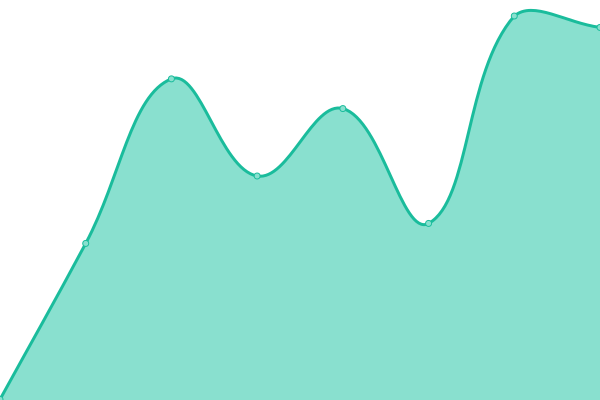
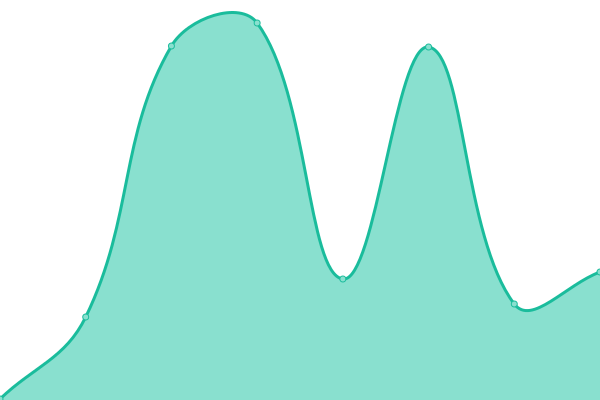
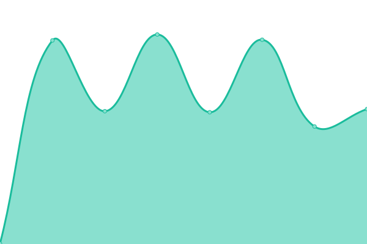

# [📈 Live Status](https://omerxx.github.io/upptime): <!--live status--> **🟩 All systems operational**

This repository contains the open-source uptime monitor and status page for [Omer Hamerman](https://omerxx.com), powered by [Upptime](https://github.com/upptime/upptime).

With [Upptime](https://upptime.js.org), you can get your own unlimited and free uptime monitor and status page, powered entirely by a GitHub repository. We use [Issues](https://github.com/omerxx/upptime/issues) as incident reports, [Actions](https://github.com/omerxx/upptime/actions) as uptime monitors, and [Pages](https://omerxx.github.io/upptime) for the status page.

<!--start: status pages-->
<!-- This summary is generated by Upptime (https://github.com/upptime/upptime) -->
<!-- Do not edit this manually, your changes will be overwritten -->
<!-- prettier-ignore -->
| URL | Status | History | Response Time | Uptime |
| --- | ------ | ------- | ------------- | ------ |
|  [Website](https://zesty.co) | 🟩 Up | [website.yml](https://github.com/omerxx/upptime/commits/HEAD/history/website.yml) | 

 342ms
     
 | 

<a href="https://omerxx.github.io/upptime/history/website">100.00%</a>
    

|  [Dashboard](https://app.zesty.co) | 🟩 Up | [dashboard.yml](https://github.com/omerxx/upptime/commits/HEAD/history/dashboard.yml) | 

 400ms
     
 | 

<a href="https://omerxx.github.io/upptime/history/dashboard">100.00%</a>
    

|  [API](https://api.cloudvisor.io) | 🟩 Up | [api.yml](https://github.com/omerxx/upptime/commits/HEAD/history/api.yml) | 

 317ms
     
 | 

<a href="https://omerxx.github.io/upptime/history/api">100.00%</a>
    

|  RC Dashboard | 🟩 Up | [rc-dashboard.yml](https://github.com/omerxx/upptime/commits/HEAD/history/rc-dashboard.yml) | 

 169ms
     
 | 

<a href="https://omerxx.github.io/upptime/history/rc-dashboard">100.00%</a>
    

|  KN Dashboard | 🟩 Up | [kn-dashboard.yml](https://github.com/omerxx/upptime/commits/HEAD/history/kn-dashboard.yml) | 

 769ms
     
 | 

<a href="https://omerxx.github.io/upptime/history/kn-dashboard">100.00%</a>
    

|  GD Dashboard | 🟩 Up | [gd-dashboard.yml](https://github.com/omerxx/upptime/commits/HEAD/history/gd-dashboard.yml) | 

 1353ms
     
 | 

<a href="https://omerxx.github.io/upptime/history/gd-dashboard">100.00%</a>
    

|  CT Dashboard | 🟩 Up | [ct-dashboard.yml](https://github.com/omerxx/upptime/commits/HEAD/history/ct-dashboard.yml) | 

 797ms
     
 | 

<a href="https://omerxx.github.io/upptime/history/ct-dashboard">100.00%</a>
    

<!--end: status pages-->

[**Visit our status website →**](https://omerxx.github.io/upptime)

## 📄 License

- Powered by: [Upptime](https://github.com/upptime/upptime)
- Code: [MIT](./LICENSE) © [Omer Hamerman](https://omerxx.com)
- Data in the `./history` directory: [Open Database License](https://opendatacommons.org/licenses/odbl/1-0/)
